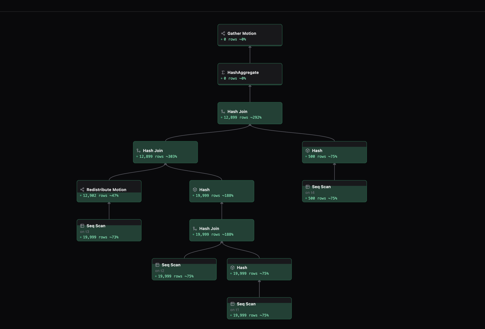

#  whpg_plan_tree

A standalone extension for WarehousePG (WHPG) -- and, unmodified, for
other GPDB-lineage databases, Greenplum itself included -- that captures
the *real*, already-planned plan tree of every running query into shared
memory and exposes it over SQL as `plan_tree.plan_tree_detail`. Nothing
to patch and no core changes on any server: just install this extension.



*A running query, live: the node labels and tree shape come straight from
the captured plan (not an `EXPLAIN` reconstruction), joined with the
per-node row counters already in the metrics shared-memory ring -- rows
and ~progress update while the query executes. Rendered by
[pg_dash](https://github.com/avamingli/pg_dash)'s Watch feature.*

## Background

There has long been no open-source way to watch a running query's plan
as a *live*, visual tree. A major reason: nothing outside the running
backend can see the real plan. Re-running `EXPLAIN` on the same SQL
text costs an extra planning pass, and what it returns is a fresh plan
that only *usually* matches the one actually executing; other
reconstruction tricks share the same accuracy problem. This extension
offers a very simple way out: capture the real, already-planned tree
directly, at query start -- no kernel changes anywhere, installing the
extension is all it takes.

## Installing

This is a genuinely pluggable extension -- it never needs to be copied
into, or built as part of, any kernel source tree. Build it with PGXS
against whichever target's `pg_config` is on `PATH` (or pass it
explicitly), entirely from this directory:

```sh
make USE_PGXS=1 PG_CONFIG=/path/to/target/bin/pg_config
make USE_PGXS=1 PG_CONFIG=/path/to/target/bin/pg_config install
```

Then, one-time on that server (needs a restart for the GUC/hook to take):

```sql
-- gpconfig -c shared_preload_libraries -v whpg_plan_tree && gpstop -raf
CREATE EXTENSION whpg_plan_tree;
SELECT * FROM plan_tree.plan_tree_detail;
```

Lives in its own `plan_tree` schema, deliberately not `query_metrics`
(that schema belongs to the unrelated, pre-existing
`gp_instrument_shmem_detail`) and deliberately not `gp_`-prefixed (GPDB
reserves that prefix for system schemas).

Consumed by [pg_dash](https://github.com/avamingli/pg_dash)'s "Watch"
live query plan tree feature (`Capabilities.RealPlanShmem`) -- the
feature is hidden entirely on a server without this extension installed,
rather than degrading to an `EXPLAIN`-based reconstruction.

## Configuration

Two GUCs. The one that matters day-to-day is `whpg_plan_tree.capture`
(what gets captured); `whpg_plan_tree.size` is a set-once sizing knob.

### `whpg_plan_tree.capture` -- selective capture

`whpg_plan_tree.capture` (`PGC_USERSET`, boolean, default `true`) is a
second, per-backend gate checked after `gp_enable_query_metrics`. Unlike
`whpg_plan_tree.size` below, this one is a plain per-backend variable, so
the standard PostgreSQL GUC layering applies with no extra work: a
server-wide default (`postgresql.conf` or `ALTER SYSTEM SET ...; SELECT
pg_reload_conf();` -- no restart needed), any session can override it
just for itself with `SET`, `SET LOCAL` for just the current transaction.

Default `true` keeps today's behavior unchanged: enabling
`gp_enable_query_metrics` captures every query, exactly as before. An
operator can flip the server-wide default to `false` to capture *only*
sessions that explicitly `SET whpg_plan_tree.capture = on` for
themselves -- e.g. a client that only ever wants to watch queries it
itself is about to run can set this right before running one.

This can *not* retroactively give you the ability to watch an arbitrary
query that's already running and wasn't pre-selected for capture: the
capture decision happens once, at `METRICS_PLAN_NODE_INITIALIZE`, right
as a statement starts -- by the time you'd notice a slow query and want
to watch it, that moment has already passed. Keeping the default `true`
is what preserves "watch any already-running query" as a capability;
flipping it trades that away for a narrower, cheaper, explicitly-opted-in
set of watchable connections.

### `whpg_plan_tree.size` -- shared-memory pool

`whpg_plan_tree.size` (`PGC_POSTMASTER`, KB, default 8192 = 8MB, range
0-131072) sizes a **fixed** pool of slots allocated once at postmaster
startup -- it does not grow at runtime, and changing it needs a restart.
Two independent limits follow from that:

- How many captures can be in flight *at once*: size / slot size. Once
  the pool is full, a new query's capture is silently skipped (degrades
  gracefully -- never blocks or errors the query itself).
- How many nodes *one* capture can hold: 128 (`WHPG_PLAN_TREE_MAX_NODES`).
  A plan with more nodes than that gets truncated (rest dropped, a
  `truncated` flag set) rather than overflowing -- the same
  `MAX_SCAN_ON_SHMEM`-style fixed bound the existing per-node
  instrumentation ring already uses.

## How it works

The capture rides entirely on the existing `query_info_collect_hook`
(`utils/metrics_utils.h`): at `METRICS_PLAN_NODE_INITIALIZE`, right as a
statement starts, the already-planned tree is walked once into this
module's own shared-memory pool, keyed by `tmid/ssid/ccnt/segid/nid` --
the same key the live per-node row counters `gp_enable_query_metrics`
already maintains (`InstrumentationSlot`) use, so a consumer can join
real node labels and tree shape with live row counts. (`EXPLAIN` never
prints `plan_node_id` in any format, so this join is exactly what no
external monitor could reliably do before.)

## Portability

Built primarily for open-source
[WarehousePG](https://github.com/warehouse-pg/warehouse-pg); also
verified live, unmodified, across all GPDB-variant databases, spanning
PG kernel versions 12 through 20, from one shared source file guarded
by `#if PG_VERSION_NUM`:

| PG core era | Shared-memory registration |
|---|---|
| < PG15 | direct `RequestAddinShmemSpace()`/`RequestNamedLWLockTranche()` in `_PG_init()` -- no `shmem_request_hook` exists yet |
| PG15 through PG18 | classic `shmem_request_hook`/`shmem_startup_hook` chaining |
| PG19 and PG20 | `RegisterShmemCallbacks()`/`ShmemRequestStruct()` |

`query_info_collect_hook` itself -- the hook this module rides on -- is
byte-identical (typedef, enum values, header location) across every
supported target. A smaller seam:
`T_IncrementalSort`/`T_Memoize`/`T_TidRangeScan` don't exist as
`NodeTag`s on PG12-era targets (PG12 predates all three upstream);
gated by the real upstream introduction version, not assumed from a
version number that isn't always representative of NodeTag coverage on
a GPDB-variant fork -- confirmed directly against each target's own
headers. Every one of the 58 `NodeTag`s this module's label switches
reference has been individually checked against each target's
`nodes.h`/`nodetags.h` -- those three are the *only* gaps found
anywhere; nothing else is missing on any target.

## Testing

```sh
make USE_PGXS=1 PG_CONFIG=/path/to/target/bin/pg_config installcheck
```

Runs `sql/whpg_plan_tree.sql` through `pg_regress`/`gpdiff` against
`expected/whpg_plan_tree.out`. Needs the same precondition as any real
use (`gp_enable_query_metrics = on`, `whpg_plan_tree` in
`shared_preload_libraries`, both already set on the target it's pointed
at) -- the test asserts real captured rows exist, so it fails loudly,
not silently, if that's missing. See the header comment in
`sql/whpg_plan_tree.sql` for why the test deliberately checks structural
invariants (a capture exists, the coordinator's own tree has exactly one
root, every node has a real label) instead of diffing an exact plan
shape or asserting cross-segment tree-shape invariants -- both would be
flaky for reasons that have nothing to do with this extension's own
correctness (planner choice, table statistics, and, confirmed live
against a long-lived dev cluster, occasional historical-key reuse in the
shared ring that a live consumer never actually hits in practice).

## License

The [PostgreSQL License](LICENSE) -- a permissive, OSI-approved,
BSD-style license, the same one PostgreSQL itself and most of its
contrib modules (including pg_stat_statements, whose `_PG_init()`
structure this module's own mirrors) use. Chosen for maximum
compatibility across every target this extension supports: WHPG (its
primary target) and, incidentally, both PostgreSQL-License and
Apache-2.0-licensed GPDB-lineage databases generally can freely include
code under it.
